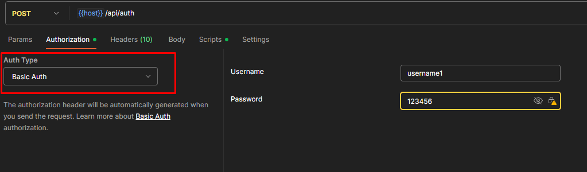
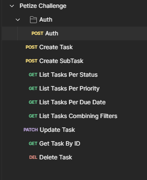

# Funcionalidades Obrigatórias:

~~- Criar tarefa com título, descrição, data de vencimento, status e prioridade.~~

~~- Listar tarefas com filtros por status, prioridade e vencimento.~~

~~- Atualizar o status da tarefa.~~

~~- Deletar tarefa.~~

~~- Impedir conclusão de tarefa com subtarefas pendentes.~~


# Funcionalidades Opcionais (Diferenciais):

~~- Autenticação JWT com rotas protegidas.~~

~~- Associações de tarefas por usuário autenticado.~~

~~- Validação com @Valid e mensagens claras.~~

- Documentação com Swagger ou README completo.

- Testes unitários e de integração.

~~- Docker Compose com banco de dados.~~

~~- Paginação, ordenação e upload de anexo.~~

# Entrega:

- Vídeo explicativo (opcional).

# To-do (meus)

- Inserir mais validações na camada service

# Desafio Petize - API de Gerenciamento de Tarefas

API RESTful para gerenciamento de tarefas (To-do list) com um sistema completo de autenticação e autorização via JSON 
Web Tokens (JWT), construída com Java e Spring Boot.

## ✨ Features

* CRUD completo de Tarefas.
* Sistema de autenticação via JWT (Login com username e password).
* Autorização baseada em Roles (ADMIN, USER) para proteger os endpoints.
* Gerenciamento de subtarefas com relacionamento pai-filho.
* Regra de negócio para impedir a conclusão de tarefas com subtarefas pendentes.
* Filtros para listagem de tarefas (status, prioridade, data).
* Estrutura de banco de dados gerenciada com Flyway Migrations.
* Ambiente de banco de dados isolado com Docker Compose.


## 🛠️ Tecnologias Utilizadas

* Java 21
* Spring Boot 3.x
* Spring Security 6.x: Para autenticação e autorização.
* Spring Data JPA / Hibernate: Para persistência de dados.
* PostgreSQL: Banco de dados relacional.
* Docker & Docker Compose: Para containerização do banco de dados.
* Flyway: Para gerenciamento de migrações do banco de dados.
* Maven: Para gerenciamento de dependências e build do projeto.
* JJWT (Java JWT): Para geração e validação de JSON Web Tokens.

## 🚀 Como Executar o Projeto

1. Pré requisitos

Antes de começar, garanta que você tem as seguintes ferramentas instaladas:

* Git
* JDK 21 (LTS) (Recomendado Eclipse Temurin)
* Docker Desktop
* Apache Maven (ou use o Maven Wrapper incluído no projeto)
* Uma IDE de sua preferência (ex: IntelliJ IDEA, VS Code

2.  Clonando o Repositório

Abra seu terminal e clone o projeto para sua máquina local:

```bash
git clone https://github.com/zenonxd/desafio-petize
cd desafio-petize
```

3. Iniciando o Banco de Dados

O projeto utiliza Docker para criar um ambiente de banco de dados PostgreSQL isolado.

No terminal, na raiz do projeto, execute o comando:

```bash
docker-compose up -d
```

Este comando irá iniciar o container do PostgreSQL em segundo plano. Na primeira vez, ele pode demorar um pouco para baixar a imagem.

**Para garantir que não exista nenhum problema para acessar o PostgreSQL, minha versão é 16 e porta 5433.**

4. Executando a Aplicação

Encontre a classe principal DesafioPetizeApplication.java.

Execute o método main clicando no ícone de "play".

# Instruções - Utilizando a API

A API está protegida com JWT. Para acessar a maioria dos endpoints, você primeiro precisa se autenticar.

**Abaixo, url do environment do Postman, contendo variáveis de ambiente e um script para alocar o token gerado para cada
requisição.**

[Link Environment]() 

1. Autenticação (Login)

Já deixei um script onde o Flyway criou dois usuários de teste. A senha para ambos é 123456 (este valor está em hash).

Usuário 1: username1 (Role: ADMIN)

Usuário 2: username2 (Role: USER)

**Faça uma requisição POST para o endpoint de login para obter seu token de acesso.**

```http request
POST http://localhost:8080/api/auth
```



2. Acessando Endpoints Protegidos

O script do environment alocará o token automaticamente para que seja feita as outras requisições desejadas.



# Breve Explicação Config JWT

Ao invés de utilizar métodos mais antigos de implementações do JWT e Spring Security, optei por algo mais atual.

Na hora de configurar o JWT, existem muitos exemplos na internet usando JwtUtils, fazendo tudo na mão.

Basicamente configurei 3 componentes: UserDetails, UserDetailsService e Security Config.

---

Inicialmente, criamos a entidade User, juntamente com seu repositório e uma migration para criar a tabela no PostgreSQL.

Agora sim, começamos a lógica dos componentes.

## UserDetails

Interface que irá armazenar as informações do usuário que está logado no sistema (username, senha, authorities).

Criamos a classe "UserAuthenticated" que estende essa interface do UserDetails.

Injetamos a entidade User por meio de construtor, e implementamos os métodos da interface.

[Veja a classe aqui]()

## UserDetailsServiceImpl

Classe responsável por implementar a interface supracitada.

Ela será responsável por buscar e retornar o UserDetails pelo username.

Além disso, ela é chamada automaticamente durante a autenticação para retornar o UserDetails.

[Veja a classe aqui]()

## JwtService

Essa classe é IMPORTANTÍSSIMA, responsável por criar e assinar JWT para um User autenticado com sucesso.

Utilizei e injetei nela o JwtEnconder, do OAuth2 Resource Server. Mesmo não usando OAuth, a gente utiliza a capacidade do servidor de recurso para codificar
e decodificar um token JWT.

[Veja a classe aqui]()


## Security Config

Por fim, com todos esses Beans criados partimos para a criação do SecurityConfig, responsável por "colar" todos esses beans,
orquestrando todo esse trabalho, mostrando como a Segurança/Autenticação será feita.

Essa classe irá habilitar a segurança do projeto como, por exemplo, configurando os filtros da aplicação.

Faz enconde e decode do JWT, settará autorização de rotas, etc.

[Veja a classe aqui]()
